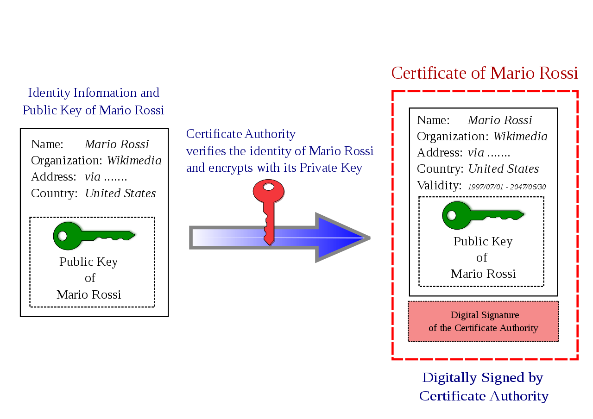
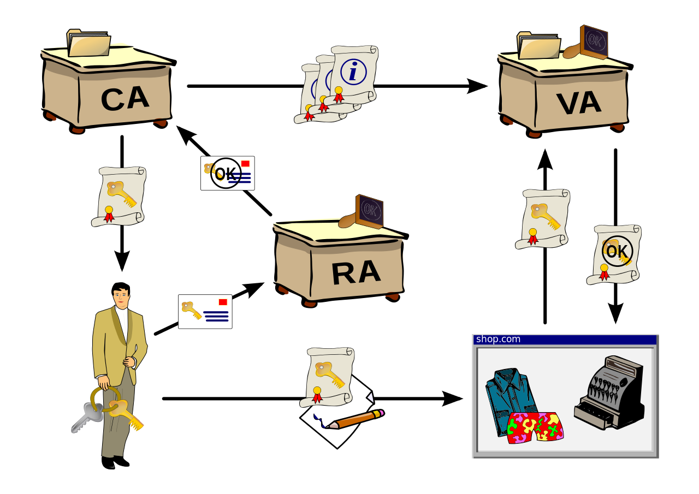
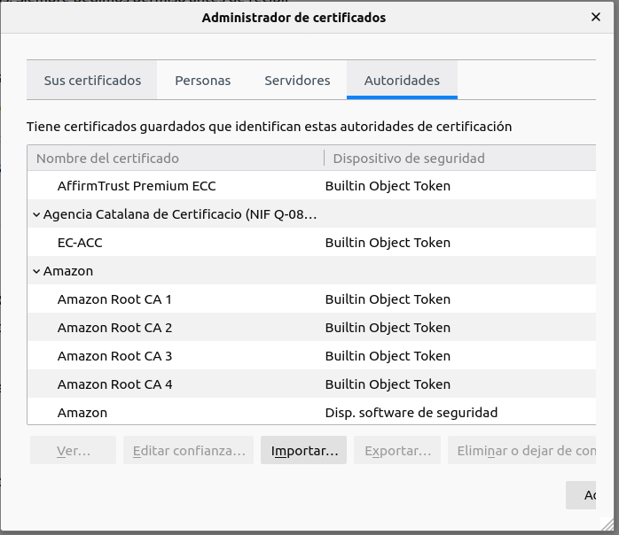

<!-- ---
title: "SPD - Autoritat Certificadora"
author: [Francesc Xavier Bullich Parra, GEINF (UDG-EPS)]
date: 2 de Gener de 2020
subject: "Udg - Eps"
tags: [CA]
subtitle: "Tutor de la pràctica : Antonio Bueno"
titlepage: true

... -->

\newpage

# Objectiu

L'objectiu del treball és mostrar quins son els elements que composen una autoritat certificadora (CA). També mostraré una forma de crear una autoritat certificadora pròpia, per tal de poder crear certificats de confiança propis.

# Introducció

Una autoritat certificadora és una entitat de confiança que és responsable d'emetre i revocar certificats digitals. Aquests certificats s'usen principalment per garantitzar la seguretat de les comunicacions digitals via TLS-HTTPS. S'utilitiza criptograrfia de clau pública per generar les claus i els certificats.

La CA dona el servei de certificació, que garantitza la relació entre una persona (física o jurídica) i la seva clau pública (certificat), es a dir, un certificat digital ha de identificar a una persona i s'ha de poder confiar en aquesta relació.

{height="350px" width="350px"}

 
## Infraestructura PKI

Tota la gestió de certificats digitals es fa a través d'un PKI (Public key infraestructure). De fet la CA és només una part del PKI.

El PKI es divideix en diversos subsistemes:

- CA: Rep les peticions i crea els certificats. Es responsable d'administrar el cicle de vida dels certificats (temps màxim de validesa o revocació).
- RA: Autoritat de registre és una interficie entre l'usuari i l'autoritat de certificació. Ha d'identificar el solicitants o titulars dels certificats. 
- VA: Autoritat de validació emmagztzema els certificats digitals i aministra l allista de certificats caducats o revocats. També posa a disposició tots els certificats emesos per l'autoritat de certificació.
- Autoritat de custodia: Emmagatzema de forma segura les claus de xifrat que utilitza l'autoritat certificadora.

{height="350px" width="350px"}

## Confiança

Existeixen 2 tipus de certificats: certificats autosignats o certificats signats per una autoritat certificadora.

Els certificats autosignats es poden crear facilment. Es tracten de certificats els cuals el propietari i el signatari son el mateix. En alguns casos aquets certificats son suficients per determinades accions. Moltes aplicacions pero, sobretot navegadors, no accepten aquest tipus de certificat i exigeixen que el certificat estigui signat per una autoritat certificadora de confiança.

Els navegadors confien en una serie de CA, que suposadament, compleixen tots els requeriments per actuar com a CA. Aquesta confiança fa que si es troven un lloc web amb un certificat signat per alguna d'aquestes entitats, validin el certificat i deixa navegar sense problemes. Si trova un certificat autosignat o signat per una CA que no te com a autoritat de confiança, no ens deixerà navegar.

{height="350px" width="350px"}

Si creem una autoritat de certificació propia, haurem d'incorporar-la a les autoritats de confiança dels nostres dispositius per tal que les reconeguin. 

## Jerarquia d'una CA

Com ja s'ha explicat, es necessari que els certificats estiguin signats per una CA. Aquesta CA tindrà els seu propi certificat per tal de poder signar les peticions que rebi.

Les CA solen treballar en jerarquia: tenen un certificat arrel, que està a sobre de tota la jerarquia. Aquest certificat s'utilitza per crear certificats intermedis que poden servir per diferents proposits.

El que se sol fer és que el cerfificat arrel només firma els cerfiticats intermedis. Els intermedis s'encarregen de signar peticions dels diferents usuaris de la CA. D'aquesta manera es pot protegir millor el certificat arrel. Si algun dels certificats  fos compromés, s'hauria de revocar, el que comportaria revocar també tots els certificats emesos. Per tant si utilitzem certificats intermedis és menys probable que es comprometi el certificat arrel. D'aquesta manera no perdriem tota la CA.

Els certificats arrel son autosignats degut a que no tenen cap instancia superior que el pugi signar. Per tant en aquest cas s'ha 'confiar' que el certificat arrel sigui 'correcte'.

\newpage

# Construcció d'una CA

\newpage

# Referències

[1] Que és una CA - [https://es.wikipedia.org/wiki/Autoridad_de_certificaci%C3%B3n](https://es.wikipedia.org/wiki/Autoridad_de_certificaci%C3%B3n)
